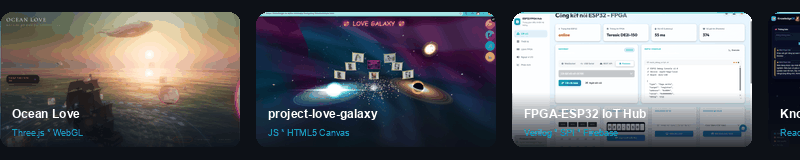
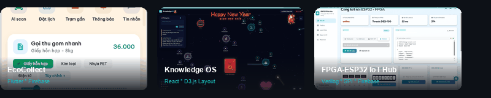

<!-- ══════════════════════════════════════════════════════ -->
<!--                    HEADER SECTION                     -->
<!-- ══════════════════════════════════════════════════════ -->

<!-- Typing Animation -->

 

 

<!-- ══════════════════════════════════════════════════════ -->
<!--              DUAL IDENTITY: PCB × HACKER              -->
<!-- ══════════════════════════════════════════════════════ -->

  <h3>✨ Featured Project Showcases</h3>
  
  

---

<!-- ══════════════════════════════════════════════════════ -->
<!--                    TECH STACK                         -->
<!-- ══════════════════════════════════════════════════════ -->

### ⚙️ Tech Arsenal

<table>
  <tr>
    <td width="25%" align="left"><b>🔩 Hardware &amp; EDA</b></td>
    <td>
      
      
      
      
      
      
    </td>
  </tr>
  <tr>
    <td align="left"><b>💻 Languages &amp; Tech</b></td>
    <td>
      
      
      
      
      
      
      
      
      
      
      
      
    </td>
  </tr>
  <tr>
    <td align="left"><b>☁️ Cloud &amp; Tools</b></td>
    <td>
      
      
      
      
      
    </td>
  </tr>
  <tr>
    <td align="left"><b>🎯 Target Platforms</b></td>
    <td>
      
      
      
    </td>
  </tr>
</table>

---

<!-- ══════════════════════════════════════════════════════ -->
<!--                 FEATURED PROJECTS                     -->
<!-- ══════════════════════════════════════════════════════ -->

### 🚀 Featured Projects

> *From gate-level Verilog to full-stack cloud apps — each project represents a complete engineering journey.*

<table>
<tr>
<td width="50%" valign="top">

#### 🔩 Hardware & Digital Design

| Project | Tech |
|:--------|:-----|
| [**Custom FPGA-MCU Board**](https://github.com/minhkaiyo/Custom-FPGA-MCU-System-Board) — Multi-layer high-speed PCB with Cyclone IV GX + STM32H7 | `KiCad` `PDN` |
| [**Gigabit Ethernet Camera**](https://github.com/minhkaiyo/FPGA-Gigabit-Ethernet-Camera-Streaming) — Real-time pipeline: Camera → FPGA → SDRAM → GbE → PC | `Verilog` `RGMII` |
| [**SD Card Controller**](https://github.com/minhkaiyo/FPGA-SD-Card-Controller) — SPI Master & SD Card init FSM in pure Verilog | `Verilog` `FSM` |

</td>
<td width="50%" valign="top">

#### 💻 Software & Full-Stack

| Project | Tech |
|:--------|:-----|
| [**Knowledge OS**](https://github.com/minhkaiyo/knowledge-os) — Futuristic graph-based Knowledge Hub with D3.js physics & Firebase | `React` `D3.js` |
| [**EcoCollect**](https://github.com/minhkaiyo/ecocollect_mobile) — Smart Recycling ecosystem: radar map, AI scan, Eco-Points rewards | `Flutter` `Firebase` |
| [**Ocean Love**](https://github.com/minhkaiyo/Ocean-Love) — Premium interactive 3D ocean simulation with custom shaders & Boids simulation | `Three.js` `WebGL` |

</td>
</tr>
</table>

| Bridging Hardware ↔ Software | Tech |
|:--------|:-----|
| [**FPGA-ESP32 IoT Hub**](https://github.com/minhkaiyo/FPGA-ESP32-IoT-Hub) — End-to-end IoT: FPGA ↔ ESP32 (SPI) ↔ Firebase ↔ Real-time Web Dashboard | `Verilog` `WebSocket` `Firebase` |
| [**Love Galaxy**](https://github.com/minhkaiyo/project-love-galaxy) — Immersive digital universe with 6000+ lines of pure JS & HTML5 Canvas physics | `JS` `Canvas` `Math` |

---

<!-- ══════════════════════════════════════════════════════ -->
<!--                  GITHUB ANALYTICS                     -->
<!-- ══════════════════════════════════════════════════════ -->

### 📊 GitHub Analytics

  
  

 

  

 

---

<!-- ══════════════════════════════════════════════════════ -->
<!--                      FOOTER                           -->
<!-- ══════════════════════════════════════════════════════ -->

  

 

<h3 align="center">
  <i>"Hardware is the foundation. Software is the intelligence.   Together, they build the future."</i>
</h3>

  <b>— Pham Van Minh, HUST '27 —</b>

 

